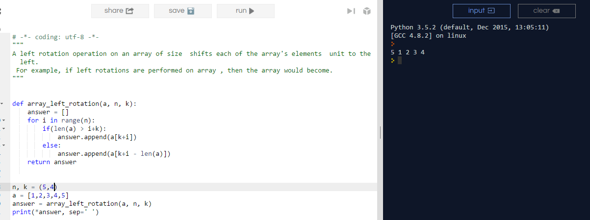

# Array Left Rotation

A left rotation operation on an array of size  shifts each of the array's elements  unit to the left.
 For example, if left rotations are performed on array , then the array would become.

https://www.hackerrank.com/challenges/ctci-array-left-rotation

# Input

5 4  
1 2 3 4 5  

# Output

5 1 2 3 4

# Sublime:
 