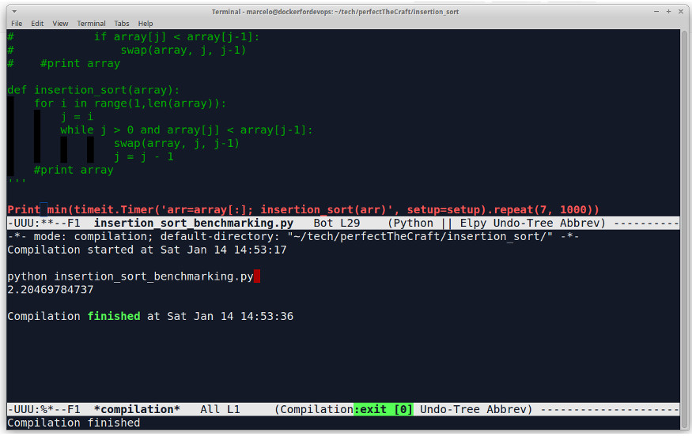

# Insertion Sort

About the insertion sort algorithm.

Brief set of steps:

1. Start moving through the items in the array <pre><code>(to_insert = i)<\pre><\code>.
2. Compare with all previous items <pre><code>(i-1, i-2, i-3, … , i-n)</pre></code> until it reaches the beginning of the array.
3. Swap when necessary <pre><code>(insert smallest numbers on the left side of the array)</pre></code>.

What did we learn here?

* Insertion sort sucks.
* It is nice to keep this “reverse iteration” technique in mind ( for i in range(n, 0 , -1) ). Might come in handy later on.

# Output:

```python
python insertion_sort_benchmarking.py
2.20469784737
```
*The version with the while loop is slightly faster than the one with nested for's*

# Emacs:
 *  
