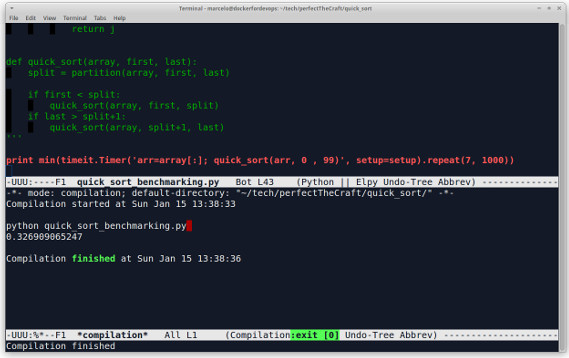

# Bubble Sort

Starting with divide and conquer algorithms.

Brief set of steps:

1. Determine the pivot.
  * Possible options:
    * first or last elements (risky).
	* Middle element.
	* Randomly chosen element.
	* Median of three elements (left, right and center or 3 elements randomly selected).

2. Start iterating and comparing from both left to right and right to left of the array. *left = i-1 and right = j+1. The search starts OUTSIDE the area of the array to allow the continuous steps even after SWAPS*
  * Increment i until
   ```python
   array[i] >= pivot
   ```
  * Increment j until
   ```python
   array[j] <= pivot
   ```
  * Once this condition is met, SWAP array[i] with array[j]
  *This will move elements that are smaller than the pivot to the left side and the larger elements will be on the right side*

3. Recursively apply `quick sort` against left and right and keep doing it until each side has only two elements left.
   ```python
   quick_sort(left)
   quick_sort(right)
   ```

What did we learn here?
* Quick sort is awesome and it breaks the problem in half on each round of recursion, that turns the average time complexity into O(n log n) - logarithmic.
  * ```python
    python quick_sort.py
	working on partition: [7, 15, 4, 9, 6, 18, 9, 12]
	working on partition: [7, 9, 4, 6]
	working on partition: [7, 6, 4]
	working on partition: [4, 6]
	working on partition: [9, 18, 15, 12]
	working on partition: [9, 12, 15]
	working on partition: [9, 12]
	[4, 6, 7, 9, 9, 12, 15, 18]

	Compilation finished at Sun Jan 15 13:15:46
	```
* ...


# Output:

 ```python
 python quick_sort_benchmarking.py 
 0.376132965088
 ```

# Emacs:
 
