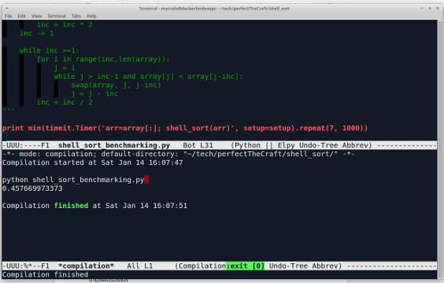

# Shell Sort (INSERTION SORT ON STEROIDS)

Ok, this involves some sub-arrays so things start to get trickier.

Brief set of steps:

1. Determine an incrementor (inc).
2. The incrementor will help us step through sub-arrays (jumps through wide gaps to cover larger numbers that are too sparse).
  * In a sample array [36,18,10,27,3,20,9,8] of size 8, the incrementor will be “3”. The program will process 3 sub-arrays ( it is an in-place algorithm so it will not literally create / copy any values onto to the heap ):
    * Sub-array 1 = indexes 0,3,6 -> 1st round compares 27 < 36.
	* Sub-array 2 = indexes 1,4,7-> 1st round compares 3 < 18.
	* Sub-array 3 = indexes 2,5-> 1st round compares 20 < 10.

  * Compare with all previous items within a given sub-array ( just like insertion sort but considering “inc”)
	```python 
	array[j] < array[j -inc]
	#SWAP
	```
  * j = j -inc  # i - inc, i-(inc\*2), i-(inc\*3), … , i-(inc\*n)

3. Lower the value of the incrementor in half after every cycle ( narrowing down the sorting scope ). Eventually the incrementor will be 1 so there will be a quick round of the regular insertion sort, it shall be optimized as the larger items will no longer be spread too far.


What did we learn here?

* Shell sort is WAY BETTER than insertion sort. Kudos to Donald Shell (the dude developed this algorithm back in 1959).
* I feel that a nested “for” is not the ideal option (at least not in Python) because the decrement i - inc*n happens only when an items becomes eligible to be inserted somewhere else, hence the “while” and the j = j - inc operation within the loop ( as per bullet point #2 from the algorithm’s description: compares with all previous items within its sub-array ).

# Output:

 ```python
 python shell_sort_benchmarking.py 
 0.484139204025
 ```

# Emacs:

 


