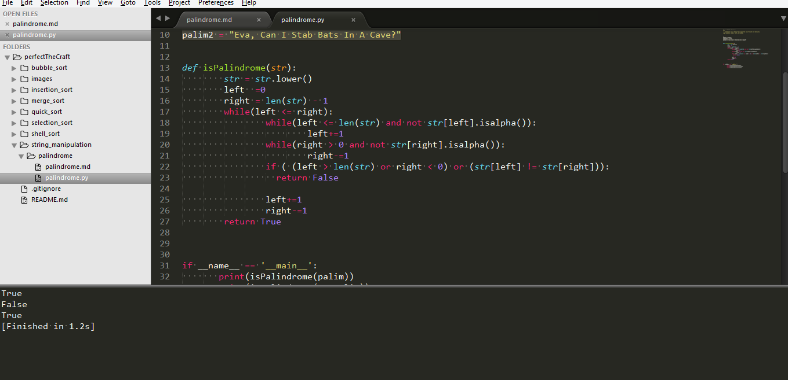

# Palindrome

A palindrome is a string that reads the same forward and backward, for example, radar, toot, and madam.

# Input

"radar"  
"sam"  
"Eva, Can I Stab Bats In A Cave?"  

# Output

True 
False 
True 

# Sublime:
 
